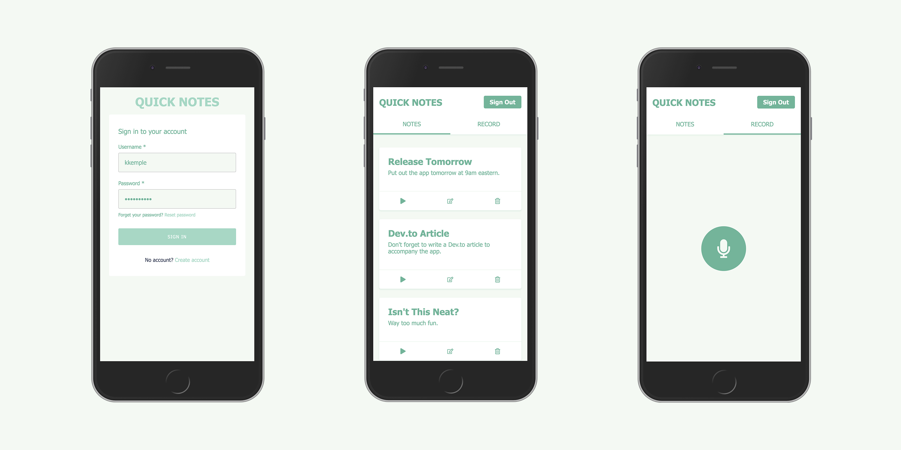

# Notes-App

#### Deploy a full stack web app to help you organize your notes when you're on the go.

🛠 Built with React, GraphQL, AWS Amplify, AWS AppSync, Amazon Transcribe, & Amazon Polly

### Features

- 🎙 Record notes
- 🔈 Play notes back
- 📖 Read notes
- 👮‍ Authenticated
- 🔥 Serverless back end
- 🚀 GraphQL
- 💻 Deploy back end in minutes



### Deploy the back end and run the app

1. Clone the repo & install the dependencies

```sh
~ git clone https://github.com/Doomedtodie/Serverless-Notes-App.git
~ cd Serverless-Notes-App
~ npm install
```

2. Initialize and deploy the Amplify project

```sh
~ amplify init
? Enter a name for the environment: dev (or whatever you would like to call this env)
? Choose your default editor: <YOUR_EDITOR_OF_CHOICE>
? Do you want to use an AWS profile? Y

~ amplify push
? Are you sure you want to continue? Y
? Do you want to generate code for your newly created GraphQL API? N
> We already have the GraphQL code generated for this project, so generating it here is not necessary.
```

3. Start the app and register a new user

```sh
~ yarn start
```

### Deploy the front end

1. Create a new repository with your git service of choice

2. Push the project to your new repository

```sh
~ git remote add origin <your_new_repository>
~ git push --set-upstream master
```

3. Connect to [AWS Amplify Console](https://console.aws.amazon.com/amplify/home) and wait for build to start. You will be given a production URL and you are ready to take some notes!


### License

This library is licensed under the MIT-0 License. See the LICENSE file.
